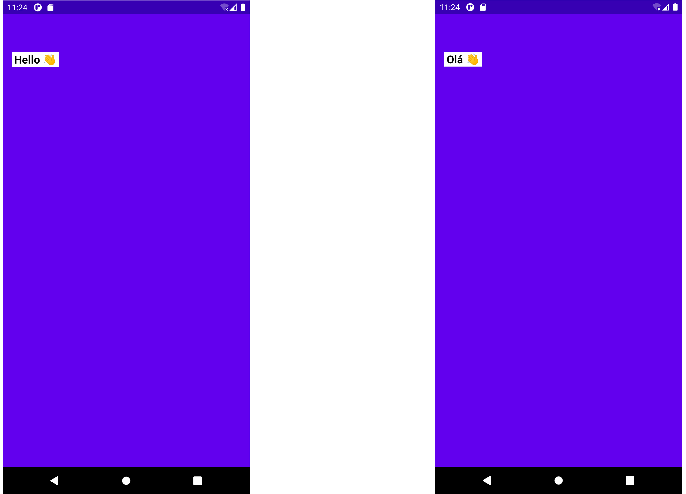
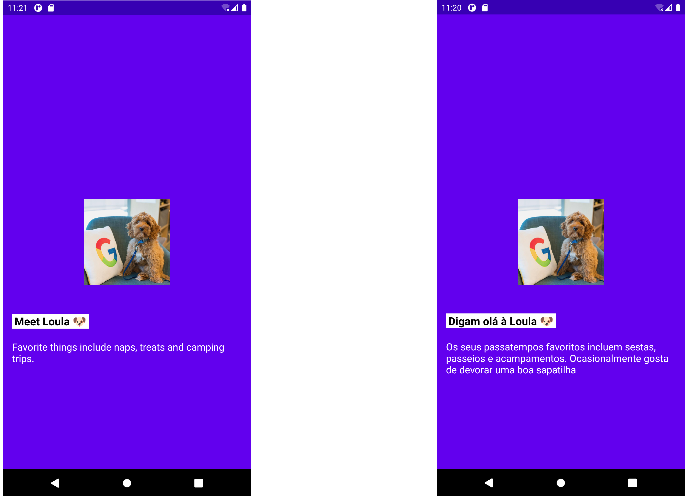

# Aula #1 - Bem-vindos ao Android 👋

Podes encontrar a apresentação desta aula no speakerdeck do ATP:

👉 [Aula 1](https://speakerdeck.com/atp/android-training-program-portugal-aula-1/)

Para correres estes projectos localmente, basta abrires uma das pastas:
- 01. Aula
- 01. Exercicio 1
- 01. Exercicio 2

Com o Android Studio.

Qualquer questão que tenhas, podes sempre falar connosco a partir do [discord](https://bit.ly/atp2020-discord)

### Exercício 1

<h3 align="center">
  
</h3>

### Exercício 2

<h3 align="center">
  
</h3>
